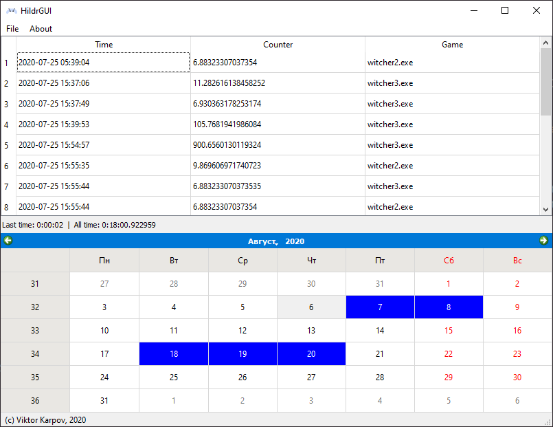

# HildrGUI
Viewer of Hildr database.

<!-- ## How to install

### Using binary (Windows)
Just download msi or portable version [here]() -->

<!-- ### Using cxfreeze setup.py
1. Install requirements `pip install -r requirements.txt`
2. Build with cxfreeze `python setup.py build` or if you want msi-installer `python setup.py bdist_msi` -->